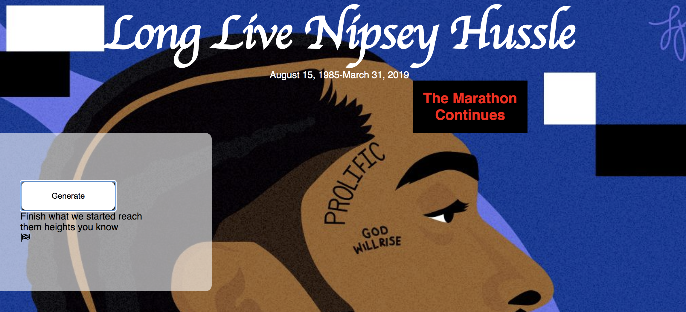

# NipseyHussleExpress

How It's Made: HTML, CSS, Javascript, EJS, node.JS MongoDB

About: Nipsey fan page! Includes Nipsey Hussle quotes. Fans can post messages to each other and share their favorite music and quotes!

Lesson Learned: how to connect to an external server the use of the Express package within the npm debugging creating and modifying Embedded Javascript Templates 
Link: nipseyhussle-48e81b.netlify.app

Installation Clone repo run npm install Usage run ./folderDir/ node server.js Navigate to localhost:3000
